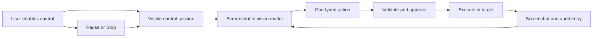

# Structured Computer Control

## Status

**In progress.** Project-preview control, constrained project-local HTML
navigation, the first allowlisted Anodex File Viewer surface, durable audits,
and a persistent native session strip are implemented. The guarded Windows
desktop adapter is now present but remains opt-in, Windows-only, and packaged
only when the native helper is built. It can target one user-selected visible
application window; it never offers unrestricted desktop control.

## Product outcome

When a user explicitly enables a control session for a visible project preview,
a vision-capable model can work through a bounded loop:

1. Observe the current screenshot.
2. Propose one typed action.
3. Let Anodex validate and, when needed, obtain approval for that action.
4. Execute it in the permitted target.
5. Capture a fresh screenshot and append an audit entry.
6. Give the screenshot to the next model round.

The user must always be able to see the controlled target, pause the session,
or stop it immediately.



## First release: project preview control

The first release controls one visible Anodex HTML preview window for the open
project. It is not an operating-system automation feature.

### Session entry

- The user opens a project HTML preview and chooses **Enable AI control**.
- Anodex verifies that a vision-capable model is active.
- The session binds to one exact preview-window id and workspace-relative HTML
  path. It cannot follow a different window, web page, or application.
- An always-visible strip shows the target, action budget, elapsed time, and
  **Pause** and **Stop** controls.
- The existing composer Stop control also ends the session when it stops the
  associated generation.

### Typed actions

The model can request only these actions:

```ts
type ComputerAction =
  | { type: 'screenshot' }
  | { type: 'click'; x: number; y: number }
  | { type: 'double_click'; x: number; y: number }
  | { type: 'drag'; from: Point; to: Point; durationMs?: number }
  | { type: 'scroll'; deltaX?: number; deltaY: number }
  | { type: 'keypress'; keys: string[] }
  | { type: 'type'; text: string }
  | { type: 'wait'; durationMs: number }
```

Every coordinate is interpreted against the latest session screenshot and
validated against the target window's bounds. The model does not receive an
arbitrary JavaScript or shell-execution escape hatch.

### Default limits

- 25 actions per session.
- 5 minutes per session.
- One action in flight at a time.
- A fresh screenshot after every successful action.
- Bounded settle time after navigation, input, scroll, or click.
- Stop after a small number of repeated failed actions against the same target.

Limits should be configurable later, but conservative fixed defaults make the
first release understandable and testable.

## User experience

The control strip should be compact and recognizably Anodex:

`AI control active · index.html · 4 / 25 actions · Pause · Stop`

The chat timeline should show understandable action cards, for example:

- Clicked **Save changes**.
- Typed a title into the preview form.
- Scrolled down 620 px.
- Waited for the preview to finish loading.

Each card links to its post-action screenshot. The session view retains the
full ordered action/screenshot history for inspection after completion, pause,
error, or user stop.

## Safety and permissions

| Risk                    | Required control                                                                                          |
| ----------------------- | --------------------------------------------------------------------------------------------------------- |
| Wrong or hidden target  | Only the exact, visible preview window bound at session start may receive actions.                        |
| Runaway loop            | Hard action, time, screenshot, retry, and one-action-at-a-time limits.                                    |
| Sensitive text          | Refuse to type into password-like fields and redact sensitive-looking text from the audit trail.          |
| External navigation     | Block navigation, popups, downloads, and external protocols in the first release.                         |
| Consequential UI action | Require a dedicated human approval, regardless of the ordinary permission mode.                           |
| Loss of control         | Pause, Stop, window close, model unload, generation cancellation, and app quit all terminate the session. |
| Ambiguous outcome       | Require the post-action screenshot before the model can issue its next action.                            |

Normal permission mode should still govern ordinary tool calls. Computer actions
need a separate policy because a seemingly harmless click can trigger a
consequential effect inside the preview. The first release should therefore
show an action preview before click, typing, drag, or keypress unless the user
has granted session-scoped control for the current preview. No approval is
remembered across sessions.

## Architecture

### Main-process owner

Add `src/main/computerControl/ComputerControlService.ts`. It is the sole owner
of session lifecycle, target binding, action validation, execution, screenshot
capture, budgets, cancellation, and renderer broadcasts.

It should expose a narrow adapter interface:

```ts
interface ComputerControlTarget {
  describe(): ComputerControlTargetInfo
  capture(signal: AbortSignal): Promise<ChatImageInput>
  execute(action: ValidatedComputerAction, signal: AbortSignal): Promise<void>
  isAlive(): boolean
  close(): void
}
```

The first adapter wraps an Anodex HTML preview `BrowserWindow`. Future browser,
Anodex-surface, and desktop adapters can implement the same interface without
teaching the model different action formats.

### Shared contract and IPC

Add `src/shared/computerControl.types.ts` for:

- Sessions and target metadata.
- Typed model actions and validated actions.
- Action statuses, approvals, failure reasons, and budgets.
- Durable audit events and screenshot asset references.

Add typed IPC in `src/shared/ipc.ts` and preload only for user-owned actions:
start, pause, resume, stop, get session state, and approve or deny the current
action. The renderer never executes input events itself.

### Model tool

Register `computer_control` only when all three are true:

1. A control session is active for the conversation.
2. The active provider supports vision.
3. The session budget has remaining capacity.

The tool accepts one typed action. `ComputerControlService` returns a concise
model result and queues the resulting screenshot into the existing per-turn
vision image queue. It must never be registered for ordinary chat, scheduled
tasks, unattended agent runs, or Critical Thinking research.

### Rendering and persistence

Reuse existing tool activity and durable visual-preview assets:

- Extend `ToolCallPreview` or add a dedicated computer-action timeline block
  for compact action cards and screenshot references.
- Store screenshot pixels through `ConversationAssetStore`, not inside
  conversation JSON.
- Store action metadata on the conversation transcript so a past session can
  be audited after restart even when an image asset has expired.
- Ensure a conversation delete removes its computer-control assets through the
  existing asset lifecycle.

## Existing foundations to reuse

| Existing component                                 | Role in computer control                                                        |
| -------------------------------------------------- | ------------------------------------------------------------------------------- |
| `src/main/htmlPreviewWindow.ts`                    | Visible, sandboxed preview-window target for phase 1.                           |
| `src/main/tools/visualInspectionTools.ts`          | Screenshot capture patterns, rendering waits, and bounded visual observations.  |
| `src/main/vision/imageInputs.ts`                   | Queueing screenshots into the next vision-model round.                          |
| `src/main/ipc/tools.handlers.ts`                   | Main-process confirmation lifecycle and cancellation behaviour.                 |
| `src/main/tools/permissions.ts`                    | Existing permission modes; computer control adds its own stricter session gate. |
| `src/main/conversations/ConversationAssetStore.ts` | Durable, bounded screenshot storage.                                            |
| Chat tool activity and preview UI                  | Timeline cards, approvals, and screenshot display.                              |

## Delivery sequence

### Milestone 0 — contract and session shell

- Add shared types, IPC, settings defaults, and a session state machine.
- Build the visible control strip, session start/stop, and an empty audit
  timeline.
- Add tests for state transitions, cancellation, and budget exhaustion.

### Milestone 1 — preview-window adapter

- Give preview windows stable ids and a safe lookup API.
- Capture screenshots from the visible target.
- Execute validated pointer, scroll, keyboard, typing, and wait actions.
- End sessions on target close, preview reload, app quit, generation stop, or
  model unload.

### Milestone 2 — model loop and approvals

- Register the model tool only within an eligible session.
- Send each post-action screenshot into the next vision round.
- Build per-action preview/approval cards and session-scoped approval.
- Implement redaction and sensitive-field blocking.

### Milestone 3 — audit and reliability

- Persist the full action/screenshot timeline.
- Add replay-friendly error reporting: target closed, coordinate invalid,
  blocked navigation, timeout, denied action, and budget reached.
- Add unit tests plus end-to-end fixtures for buttons, forms, scrollable
  content, drag targets, load delays, stop during an action, and preview close.

### Milestone 4 — controlled browser testing

Add an Anodex-owned browser/test surface with stable DOM targets and controlled
navigation. Do not broaden into arbitrary browser automation yet.

The first bounded version is a user-selected **project preview** scope: only a
clicked link to another HTML file inside the current workspace may load. Every
external URL, non-HTML file, query/fragment route, popup, download, and upload
remains blocked. This is not general browser automation.

### Milestone 5 — Anodex surfaces

Let the model operate narrowly scoped Anodex UI through stable element targets,
not raw screen coordinates.

The first Anodex-surface target is the File Viewer. It has a separate visible
**Control this panel** entry point and permits pointer input only to explicitly
tagged Preview/Code, editor, and Save controls. Typing and a short set of
single editor navigation/editing keys require focus in the explicitly tagged
editor and need approval; Save also requires approval. It rejects scrolling,
clipboard shortcuts, multi-key shortcuts, and every untagged app element before
Electron receives an input event. New Anodex surface controls must opt into this
allowlist individually.

### Milestone 6 — optional Windows desktop control

This is a separate opt-in product decision. It requires application/window
allowlists, an always-visible control overlay, protected system/password
surfaces, stronger approval rules, platform-specific input backends, and an
audit trail that remains inspectable outside the active chat.

Anodex has a separate, default-off **Desktop control** setting and a policy
gate. On Windows, a self-contained native helper is packaged from
`native/windows-control` only during packaging and is reached through a fixed
JSON protocol (never a shell, script, URL, or model-provided executable). The
user selects one listed top-level window before a session starts. The backend
rechecks its handle, process, executable path, title eligibility, and exact
bounds before every capture or action. Each desktop action always requires
ordinary user approval, the always-visible control strip remains present, and
pointer coordinates are confined to that selected window. System login/UAC,
lock-screen, password-manager, password/sign-in, payment, banking, wallet,
account-recovery, and verification-code windows are excluded. Closing or
moving/resizing the selected window ends useful control on the next operation;
Anodex never closes the external application.

Anodex's own main window is excluded from this generic desktop picker. Its
controls stay behind the narrower, DOM-tagged Anodex-surface adapters, so a
desktop session can never bypass an Anodex surface allowlist.

## Acceptance criteria for phase 1

- A user can start, pause, resume, and stop a session for one visible project
  preview.
- A vision model can complete a simple form-and-save scenario through typed
  actions and screenshots only.
- No model action can reach another window, external site, filesystem path, or
  operating-system control surface.
- Every action has an outcome and a screenshot or a clear error entry.
- Generation cancellation, target close, model unload, or budget exhaustion
  ends the session cleanly.
- Unit, integration, and end-to-end tests cover action validation, approvals,
  cancellation, asset cleanup, and the representative preview workflows.

## Explicit non-goals for phase 1

- Operating-system desktop control.
- Arbitrary browser automation or unrestricted navigation.
- Background or unattended control sessions.
- Arbitrary JavaScript execution in the controlled page.
- Password entry, payment, account recovery, downloads, uploads, or external
  side effects.
