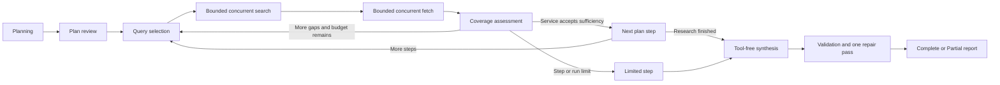

# Critical Thinking Architecture

Critical Thinking is Anodex's evidence-led research workflow. It is deliberately
implemented above the chat providers rather than as one long assistant turn. The
workflow keeps model calls short, performs network I/O explicitly, checkpoints
round state and evidence between phases, and writes the report only after research
has reached a service-owned completion or limit decision.

This document describes the implementation contract. Product-facing behavior is
summarized in `README.md`; real-model checks live in
`docs/CONTEXT_RELIABILITY_TESTING.md`.

## Design Goals

- Avoid a growing native function-call transcript and repeated context shifting.
- Preserve exact search/fetch artifacts outside model memory.
- Let the model adapt searches to remaining gaps without giving it unbounded control.
- Make Stop, limits, app interruption, and Resume preserve completed work.
- Treat search results as leads and fetched focused passages as evidence.
- Generate and validate the final report from a bounded evidence packet.
- Apply the same workflow contract to local, OpenAI, and Anthropic providers.

## Ownership

- `CriticalThinkingService.ts` owns run creation, plan review, provider pinning,
  research-attempt lifecycle, synthesis, validation, Stop/Resume, and broadcasts.
- `CriticalThinkingResearchRunner.ts` owns the adaptive round state machine for one
  plan step.
- `criticalThinkingResearchPolicy.ts` contains the pinned defaults, deterministic
  candidate selection, bounded concurrency helper, and sufficiency floor.
- `criticalThinkingResearchOutput.ts` parses and bounds model-produced query and
  assessment JSON.
- `CriticalThinkingStore.ts` persists compact run metadata and normalizes legacy
  runs.
- `CriticalThinkingEvidenceStore.ts` atomically persists full search/fetch artifacts
  in a per-run sidecar.
- `criticalThinkingEvidence.ts` builds synthesis packets and validates citations,
  quotations, numeric claims, raw URLs, and chart values.

## State Machine



The persisted top-level statuses remain `planning`, `needs-review`, `researching`,
`synthesizing`, `validating`, `completed`, `partial`, `stopped`, and `failed`.
Round status provides the finer-grained `querying`, `searching`, `reading`, and
`assessing` progress without expanding the top-level status vocabulary.

### Planning

Planning runs in an isolated generation with an empty logical history and only the
`write_plan` tool. The user can edit the resulting plan before approval. Approval
clears prior evidence for that run, initializes aggregate step state, and starts a
new bounded research attempt.

### Query selection

The runner first reuses validated follow-up queries from the preceding assessment
when they are novel. Otherwise it runs a short, tool-free model call that receives
the original question, current step, bounded prior step findings, prior queries,
remaining gaps, and the round number. Output is parsed as a bounded JSON query list;
invalid output falls back to a bounded question-plus-step query.

Every model orchestration phase has an empty logical history. Local calls also use
`sessionMode: 'isolated'`, so their native session is not reused across research
phases. If the single local engine is busy with another turn, Critical Thinking
waits and remains stoppable instead of treating the transient busy condition as a
failed investigation.

### Direct search and fetch

The runner calls the configured search provider directly rather than exposing
search schemas to the model. Searches accept the run's `AbortSignal`, execute with
bounded concurrency, and persist `web-search` artifacts. Candidate URLs are
canonicalized, ranked against query terms, deduplicated against previously fetched
URLs, and selected with domain diversity before rank is used to fill remaining
slots.

Selected pages are fetched directly with the same public-URL, DNS, redirect,
content-size, timeout, and cancellation protections used by `fetch_url`. Focused
passages are extracted using the question and current step. Individual search or
fetch failures are contained; successful siblings are retained. A round can also
reuse a previously fetched artifact when a new search surfaces the same canonical
URL.

Artifacts carry optional durable `{ stepId, roundId }` ownership. Search artifacts
remain leads. Only successful fetch artifacts with focused passages can become
verified sources, satisfy coverage, or support report citations.

### Coverage assessment and the service gate

After fetching, a short tool-free model call receives a bounded packet containing
only evidence owned by the current step. Its structured response contains:

- a bounded cumulative finding and uncertainty list;
- `continue` or `sufficient`;
- an evidence basis of `multiple-sources`, `authoritative-primary`, or
  `insufficient`;
- a concise coverage rationale;
- remaining gaps and optional novel follow-up queries.

The response is a proposal, not the completion decision. Invalid structured output
becomes `continue` with an explicit missing-assessment gap. The service accepts
`sufficient` only when the assessment declares no remaining gaps and one of these
minimum floors is met:

- `multiple-sources`: at least two distinct verified fetched URLs;
- `authoritative-primary`: at least one verified fetched URL.

This is a minimum evidence gate, not a general truth or source-authority oracle.
Citation validation later verifies report references against stored passages.
When the local model continues to list non-blocking follow-up literature after two
productive rounds, the service can also complete the step while preserving those
items as report limitations. That path requires a substantive cumulative finding,
four distinct verified URLs, at least two deterministically classified
scholarly/official sources, and no gap indicating a contradiction or
answer-blocking conflict. It is a reportability floor, not a claim that the wider
literature is exhausted.

If an assessment fills its bounded follow-up list but repeats a query already used,
the runner derives the unused slot from a recorded remaining gap. This prevents a
missing named entity from silently disappearing merely because the local model
repeated one broad search.

## Persisted Contract

`runs.json` stores compact metadata. Each run pins a
`CriticalThinkingResearchPolicy`; each step retains the existing aggregate fields
plus a lifetime `rounds` array.

Aggregate step fields remain important:

- `attempts` counts step-runner attempts, including later Resume attempts;
- `evidenceIds` is the union used to assemble step evidence;
- `finding` is the bounded cumulative finding used by final synthesis;
- `uncertainties` holds the latest unresolved gaps;
- `terminationReason` records a typed service/provider limit.

Each run may also retain bounded `synthesisDiagnostics`: the attempted synthesis
stage, visible output, stop reason, citation count, and validation issues. This is
local diagnostic state, not report content, and lets a failed local-model draft be
inspected after restart instead of being lost when a fallback replaces it.

Each `CriticalThinkingRoundState` stores:

- a stable ID and zero-based lifetime index;
- status;
- selected queries and URLs;
- evidence artifact IDs;
- a bounded finding and structured coverage assessment;
- optional termination reason;
- start and completion timestamps.

Full artifacts live under:

```text
<user-data>/critical-thinking/evidence/<run-id>.json
```

The runner flushes both stores after creating a round and after every phase that
changes durable state. The next phase therefore never intentionally advances ahead
of its checkpoint. Individual artifacts are flushed to the evidence sidecar before
their IDs or compact source metadata are written to `runs.json`; checkpoint
reconciliation also repairs any durable orphan left by a transient run-store error.

Search leads are retained only in the evidence sidecar. The compact source index
caps legacy unverified leads at 100 and replaces those leads with verified fetches
when needed. A pinned lifetime verified-source limit stops the runner before it
fetches evidence that cannot be retained; Resume resets attempt counters, not this
lifetime bound.

### Backward compatibility

`normalizeCriticalThinkingRun()` maps legacy `done`/`error` statuses, supplies the
current default policy when absent, normalizes every existing step, and gives old
steps an empty round list. It preserves aggregate findings and evidence IDs instead
of forcing a destructive data migration. Runs interrupted in an active top-level
phase reopen as Partial/resumable.

An unfinished round keeps its phase and persisted inputs. Resume skips completed
steps, continues that round without repeating already owned queries/fetches, and
can reuse the evidence sidecar. Completed, limited, and failed rounds are historical
records; a later attempt creates a new round when more research is allowed.

## Default Limits

The policy is pinned when the run is created. Current defaults are:

| Limit                                    |    Default |
| ---------------------------------------- | ---------: |
| Rounds per step per active attempt       |          3 |
| Queries per round                        |          3 |
| Search results per query                 |          5 |
| Selected pages per round                 |          4 |
| Concurrent searches                      |          3 |
| Concurrent fetches                       |          3 |
| Rounds across an active attempt          |         21 |
| Searches across an active attempt        |         63 |
| Fetches across an active attempt         |         84 |
| Verified pages across the run lifetime   |        100 |
| Active research-attempt wall clock       | 60 minutes |
| Active step wall clock                   | 10 minutes |
| Consecutive rounds with no verified page |          2 |

The round/search/fetch/time counters bound one active research attempt. Resume starts
another bounded attempt while preserving the lifetime rounds and evidence already
stored. This is why the round index can eventually exceed the per-attempt round
allowance. The verified-page cap spans the whole run lifetime so repeated Resume
cannot grow persisted evidence without bound.

User Stop remains distinct from `time-limit`, `rounds-exhausted`, `tool-limit`,
`evidence-limit`, `no-progress`, context limits, and provider limits. Step/run limits
preserve evidence and allow synthesis of a Partial report when usable fetched
evidence exists. A run at its lifetime evidence limit can still retry synthesis, but
additional collection belongs in a narrower new investigation.

## Synthesis and Validation

After the step loop ends, synthesis runs separately with no tools. Its prompt is
sized for the active provider/context and contains bounded question, plan, step
findings, and fetched-passage evidence. If there is no verified fetched evidence,
the run becomes Partial instead of inventing a report.

The draft uses internal markers such as `[[S1]]` and `[[S1:P2]]`. Validation checks:

- every substantive prose, list, or table block carries a verified citation;
- source and passage IDs exist in verified fetched evidence;
- raw URLs are not substituted for internal citation markers;
- quoted text appears in stored passages after normalization;
- cited numeric claims appear in their cited evidence, including decimals whose
  HTML table-cell boundary collapsed against a label;
- chart JSON is valid and chart values appear in one cited passage with
  normalized unit aliases such as `μg`, `ug`, and `micrograms`;
- a substantive central block supported only by a known general-reference or
  commercial source is a repairable coverage problem, not a fabrication safety
  failure.

One bounded, tool-free repair pass receives the validation issues and a reduced
evidence packet. The repaired draft is validated again. When a broad local run is
still unusable, synthesis switches to hierarchical recovery: each researched step
gets its own bounded evidence packet and independently validated section (with one
section repair when needed), then a constrained JSON phase produces only the
executive summary and conclusion. Before that overview, sections containing
universal absence or exclusivity language receive one constrained consistency
review. Its exact-substring corrections are accepted only when the revised section
remains citation-safe and does not lose cited coverage. The assembled report is
validated as a whole and is compared with the earlier candidates before selection.
Evidence packets label every source as scholarly, official, general-reference,
commercial, or unclassified and order stronger sources first within each research
step. If both model attempts for one section remain unsafe, verified
fetched-passage excerpts fill that section rather than omitting the approved
research step. Those excerpts are relevance-ranked and sentence-bounded so result
language wins over methods, questionnaire, figure, navigation, or supplementary
fragments. A deterministic overview avoids duplicating entire sections when the
model overview fails, the limits block retains at most two bounded gaps per step
(twelve total), and the final Sources section lists only sources cited by retained
report content.

When the selected local-model report contains quantitative prose but no valid
chart, one additional constrained, tool-free JSON phase may select up to two
charts. It may also explicitly select none. Values must be directly stated in one
cited passage—derived ratios, midpoints, conversions, and mixed endpoints are
rejected—and chart failure never replaces an otherwise usable report.

If model output still cannot produce a safe substantive report, a deterministic
fallback preserves multiple passages from multiple sources per step. Only then are
internal markers rendered into deterministic, title-sanitized Markdown links.
Chart fences are parsed and rewritten structurally so untrusted source metadata
cannot corrupt their JSON. Any remaining validation issue, or any limited plan step,
produces a clearly labeled Partial result.

## UI and Broadcast Behavior

The renderer shows step/round progress, the current round phase, the latest
coverage outcome, up to two remaining gaps, saved-artifact count, and the separate
synthesis/validation phases. It does not expose hidden reasoning. Activities are
persisted with a 240-entry cap; the UI renders the latest 20 initially and lets the
user reveal earlier retained entries. Partial and stopped runs keep the exact typed
limit reason and unresolved gaps visible instead of reducing them to a generic
failure message.

Run broadcasts remain throttled, and report tokens stream only during final
synthesis. Exact evidence is never sent through the report token stream.

## Invariants for Future Changes

1. Do not turn the research runner back into one native model tool loop.
2. Keep orchestration model calls isolated, short, tool-free, and provider-neutral.
3. Keep search/fetch bounded, abortable, SSRF-protected, and outside model control.
4. Checkpoint evidence and round state before advancing phases.
5. Never promote a search result or model-written URL to verified evidence.
6. Do not accept model-proposed sufficiency without the service evidence floor.
7. Keep run policies pinned and legacy normalization non-destructive.
8. Generate reports from the evidence ledger, validate each promoted candidate,
   and keep hierarchical recovery bounded and tool-free.
9. Preserve distinct Stop and limit reasons all the way to the UI.
10. Bound persisted text, activity history, concurrency, rounds, and network work.

## Known Boundaries

- Source quality still depends on the configured search provider and available
  public pages.
- The sufficiency floor is deliberately conservative but minimal; it does not
  prove that a source is authoritative or that every conclusion is true.
- Focused passages are bounded extracts, not complete archival page copies.
- Network cancellation is cooperative and cannot make a third-party server respond
  faster.
- Only one Critical Thinking run is active at a time.
- Connected private sources and mid-run user steering are still separate future
  work.
